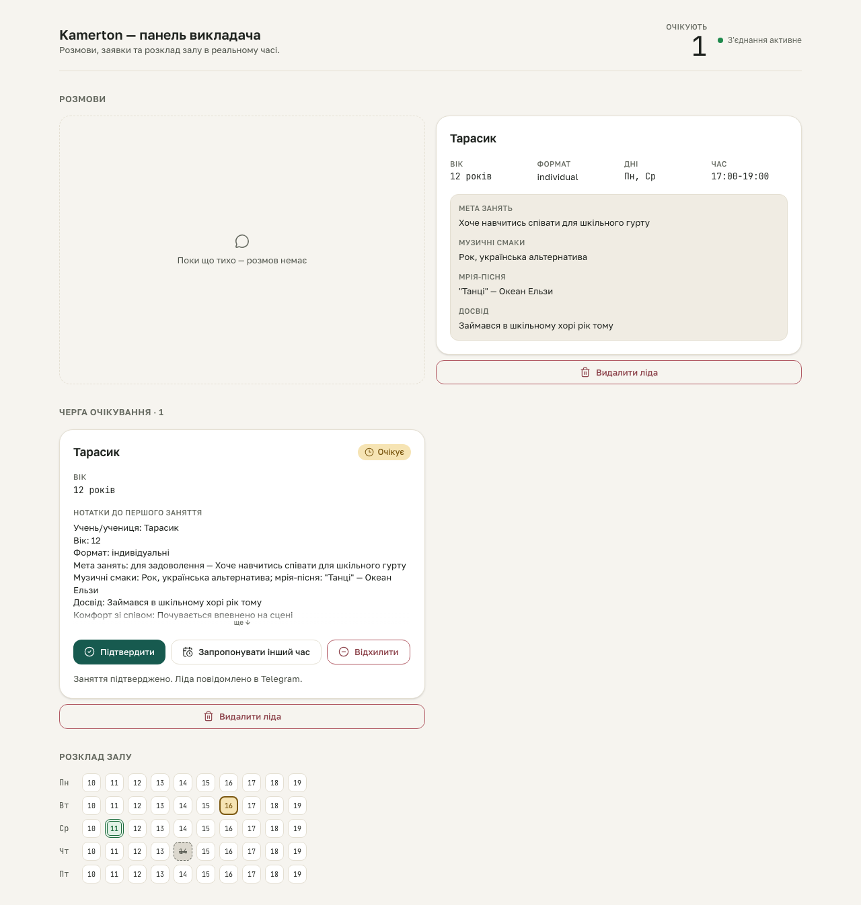

# booking-hitl S4 gate — inline decision outcome

**Proves:** FR-HITL-01 (a decision's outcome is surfaced INLINE via a `role="status"` region, never a thrown error or a silently-dead button).

**Steps:**
1. From the populated fixture, click "Підтвердити" on the pending request's DecisionBar.
2. The POST to `/api/decisions/:requestId` is intercepted (Playwright `page.route`) and fulfilled with a spec-shaped `{status:"applied", message}` body — driving a REAL POST here would either mutate the live DEMO Google Calendar against this fixture's fake `calendar_event_id`, or silently no-op without live credentials in the capture harness, so the network transport alone is mocked; the real `DecisionBar` component, its real `fetch`, and its real inline-render path all run unmodified.
3. Assert the `role="status"` region renders the outcome message.

