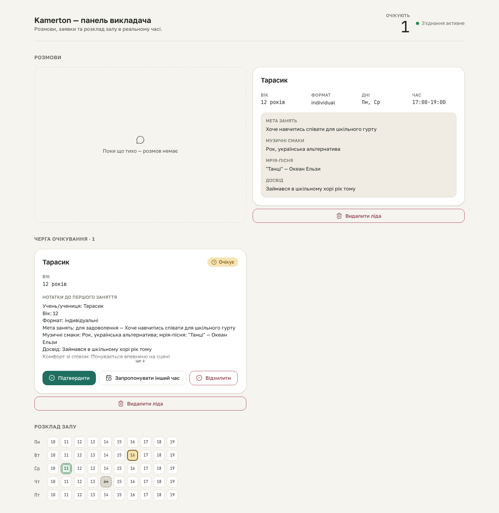

# booking-hitl S4 gate — DecisionBar actions

**Proves:** FR-HITL-01 (a pending request's card renders all three admin decision actions).

**Steps:**
1. Seed a real SQLite fixture (`scripts/qa/seed-booking-hitl-fixture.mjs`): one `awaiting_admin` request with every intake field filled, backed by a `pending` booking.
2. Boot `next start` against that DB, load `/`.
3. Assert the seeded request's `DecisionBar` shows Підтвердити / Запропонувати інший час / Відхилити, all visible and enabled.

