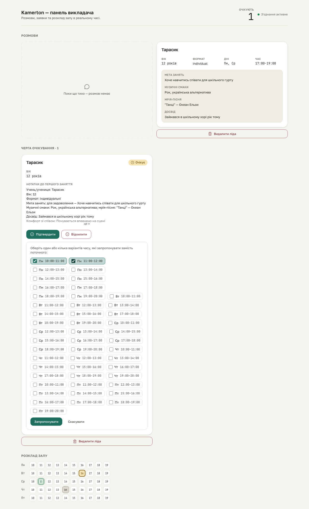

# booking-hitl S4 gate — propose-another-time slot-picker

**Proves:** FR-HITL-03 (propose-another-time reveals a concrete slot selection before it can be sent).

**Steps:**
1. From the populated fixture, click "Запропонувати інший час" on the pending request's DecisionBar.
2. Assert the inline picker (`data-testid="slot-picker"`) renders >=2 real checkbox options (`candidateProposalSlots`'s on-grid, unoccupied slots for the current week).
3. Select two candidate slots; assert "Запропонувати" becomes enabled only once >=1 slot is selected.

