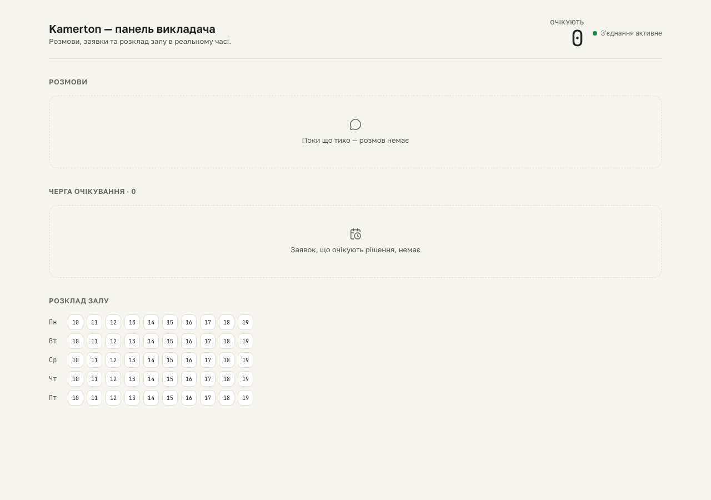

# S3 dashboard gate — empty state

**Proves:** FR-DASH-01 (dashboard renders a live, real-time view of leads/
requests/schedule — including its explicit, friendly EMPTY states, never a
blank region or an endless spinner).

**Steps:**
1. Seed a fresh SQLite DB with the schema only (zero `leads`/`requests`/
   `bookings` rows) via `scripts/qa/seed-dashboard-fixture.mjs empty`.
2. Boot `next start` against that DB and load `/` in a headless browser.
3. Assert both Ukrainian empty-state messages are visible: "Поки що тихо —
   розмов немає" (conversations) and "Заявок, що очікують рішення, немає"
   (pending queue).
4. Assert the HallMap renders exactly 50 seats (5 weekdays x 10 hourly
   slots), all with `data-status="free"`.

**Result:** asserted ✓

