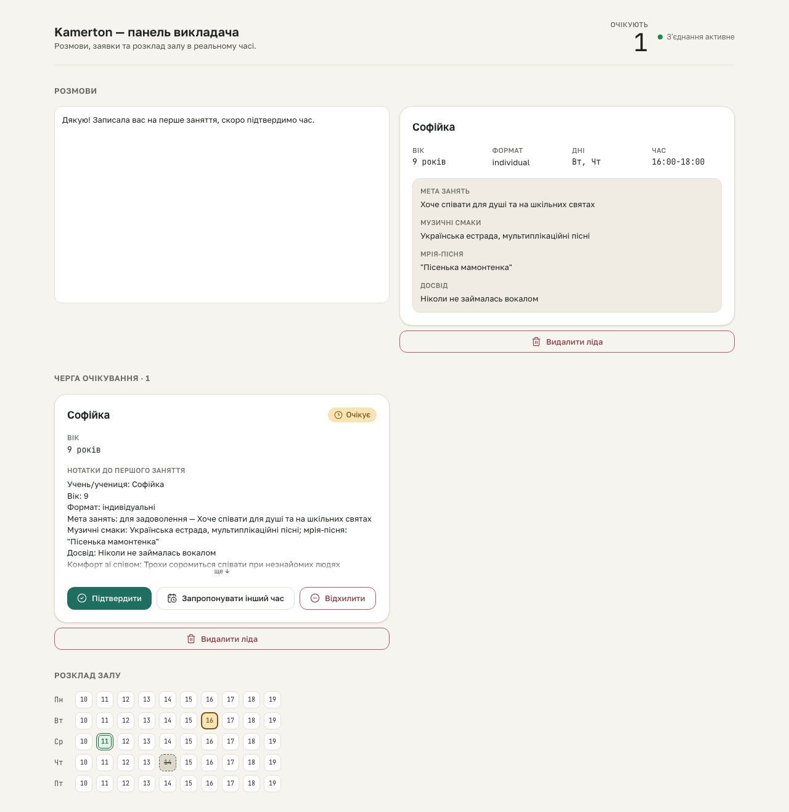

# S3 dashboard gate — populated state

**Proves:** FR-DASH-01 (live streamed conversation text + request-card
fields), FR-DASH-03 (HallMap reflects real booking statuses: pending/
confirmed/cancelled).

**Steps:**
1. Seed a populated SQLite DB (`scripts/qa/seed-dashboard-fixture.mjs
   populated`): one lead + one `awaiting_admin` request with every intake
   field filled, plus three bookings this week — `pending` (linked to the
   request via `request_id`), `confirmed`, and `cancelled`, each on a
   different weekday/hour.
2. Boot `next start` against that DB and load `/`.
3. POST a live AG-UI turn to `/api/agui/ingest` for the seeded lead's
   `telegram_chat_id` thread: `RUN_STARTED` -> `TEXT_MESSAGE_START` ->
   `TEXT_MESSAGE_CONTENT` (a Ukrainian sentence) -> `TEXT_MESSAGE_END` ->
   `RUN_FINISHED`.
4. Assert: the streamed sentence is visible in the `ChatStream`; the
   `RequestCard` shows the seeded student name; the pending-queue header
   reads "Черга очікування · 1"; the HallMap shows >=1 `pending` (amber),
   >=1 `confirmed` (green), >=1 `cancelled` (slate) seat across exactly 5
   weekday rows.
5. Screenshot full-page in LIGHT mode, then switch dark mode the way
   DESIGN.md specifies it (an explicit `data-theme="dark"` attribute on
   `<html>`, NOT `prefers-color-scheme`) and screenshot again
   (`populated-state-dark.png`, supplementary artifact for the axe/vision
   passes — not a separate manifest entry).

**Result:** asserted ✓

