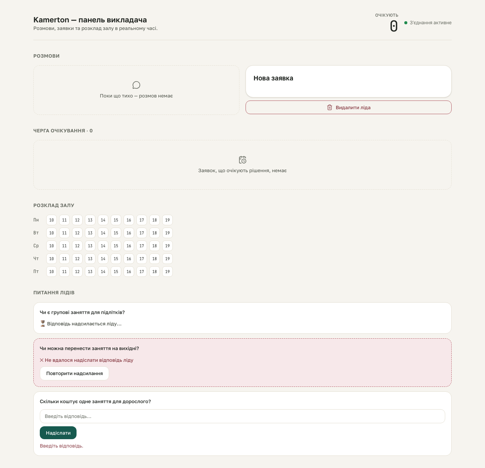

# kb-learning S5 gate — inline answer validation error

**Proves:** FR-KB-03 (an invalid answer submission is rejected inline, never a silent failure or a raw 500).

**Steps:**
1. From the populated fixture, click "Надіслати" on the open question's real answer form while it is empty.
2. This drives a REAL POST to `/api/questions/:id` — no mocking needed, since an EMPTY answer is rejected at design.md Decision 5 step 1, before the route ever touches `knowledge/school.md`.
3. Assert the inline `role="alert"` region renders "Введіть відповідь.".

