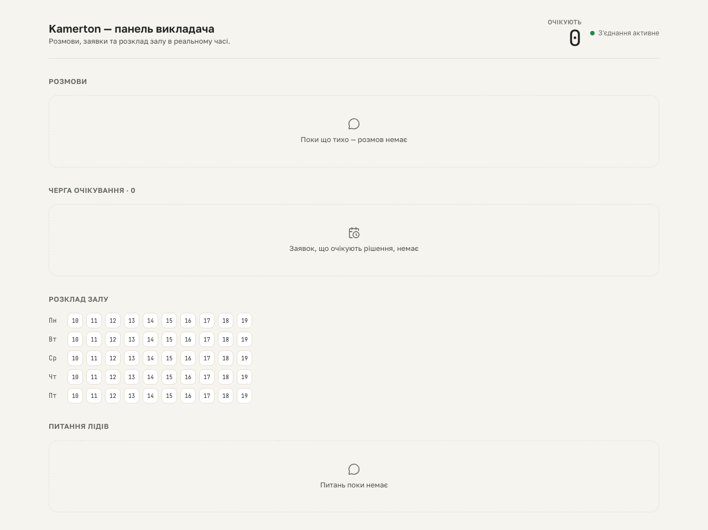

# kb-learning S5 gate — empty Question-inbox

**Proves:** FR-KB-02 (an empty inbox is an explicit empty state, never a blank area).

**Steps:**
1. Seed a real SQLite fixture with zero `questions` rows (`scripts/qa/seed-kb-learning-fixture.mjs empty`).
2. Boot `next start` against that DB, load `/`.
3. Assert the "Питання лідів" section renders the EmptyState message "Питань поки немає".

