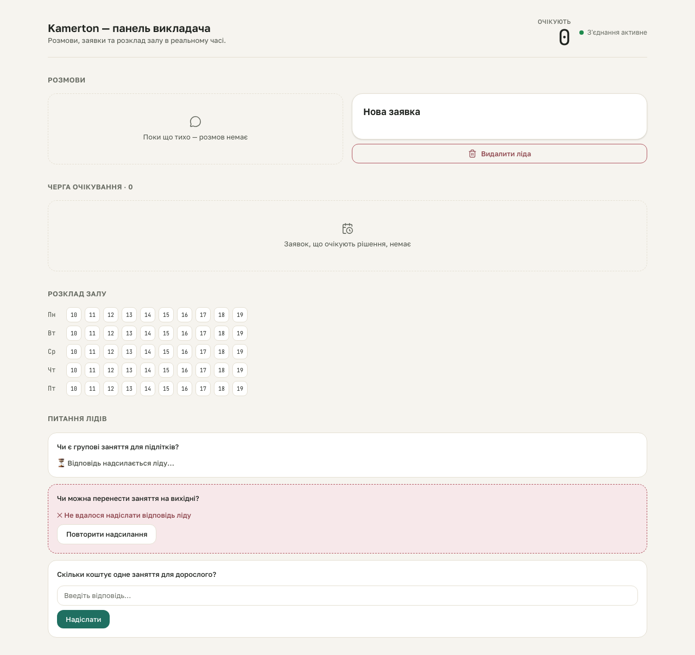

# kb-learning S5 gate — populated Question-inbox, all states at once

**Proves:** FR-KB-02 (newest-first open list), FR-KB-04 (failed/sending states distinct from an open question).

**Steps:**
1. Seed a real SQLite fixture (`scripts/qa/seed-kb-learning-fixture.mjs populated`): one lead + request backing an OPEN unanswered question, an ANSWERED+failed question, an ANSWERED+pending ("sending") question, and one `answer_source='kb'` question.
2. Boot `next start` against that DB, load `/`.
3. Assert the open row renders a real answer-form input+button; the failed row shows a ✕ glyph, a retry button, and NO answer form; the sending row shows a ⏳ glyph and NO button at all; the kb-sourced question's text never appears anywhere on the page.

