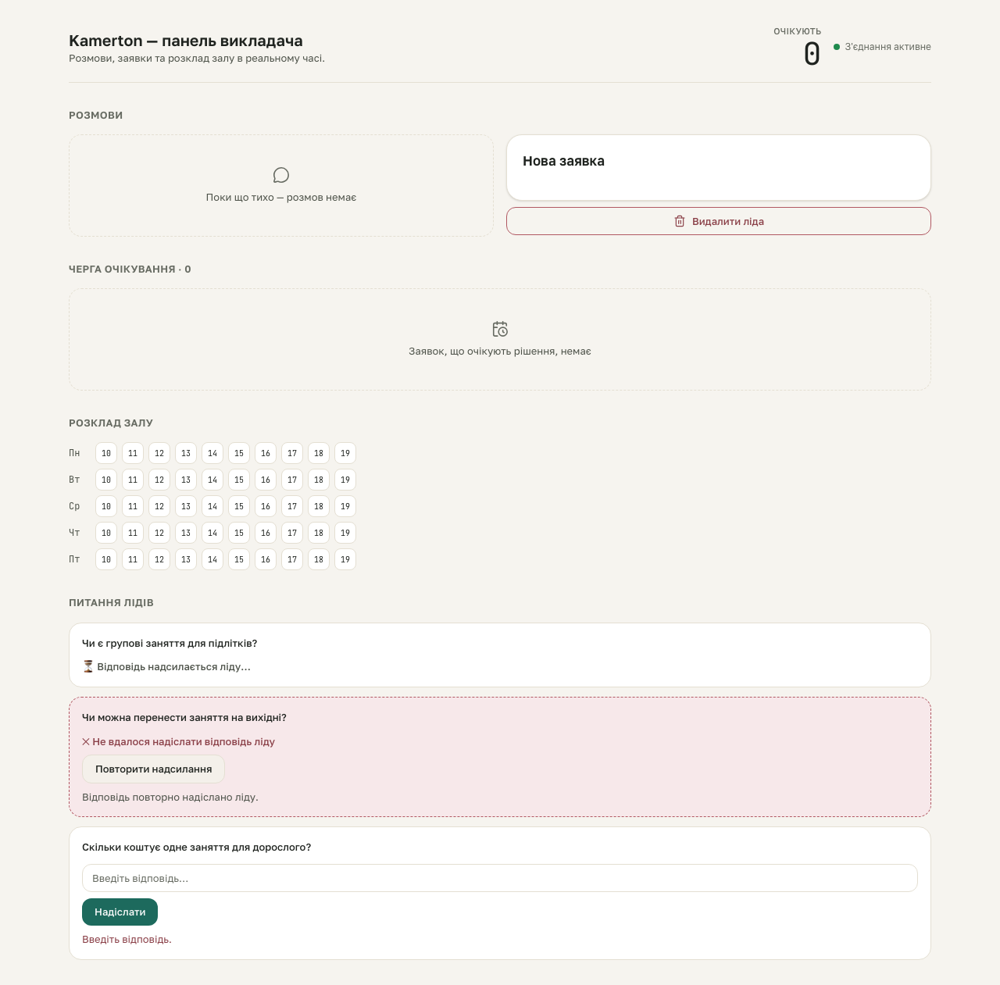

# kb-learning S5 gate — retry outcome message

**Proves:** FR-KB-04 (a failed delivery can be retried, with an inline outcome message).

**Steps:**
1. From the populated fixture, click "Повторити надсилання" on the failed row.
2. This drives a REAL POST to `/api/questions/:id/retry` — safe to run for real (unlike booking-hitl's calendar-mutating Confirm), since this route only flips `questions.delivery_status` in SQLite; it has no external I/O.
3. Assert the inline `role="status"` region renders "Відповідь повторно надіслано ліду.".

